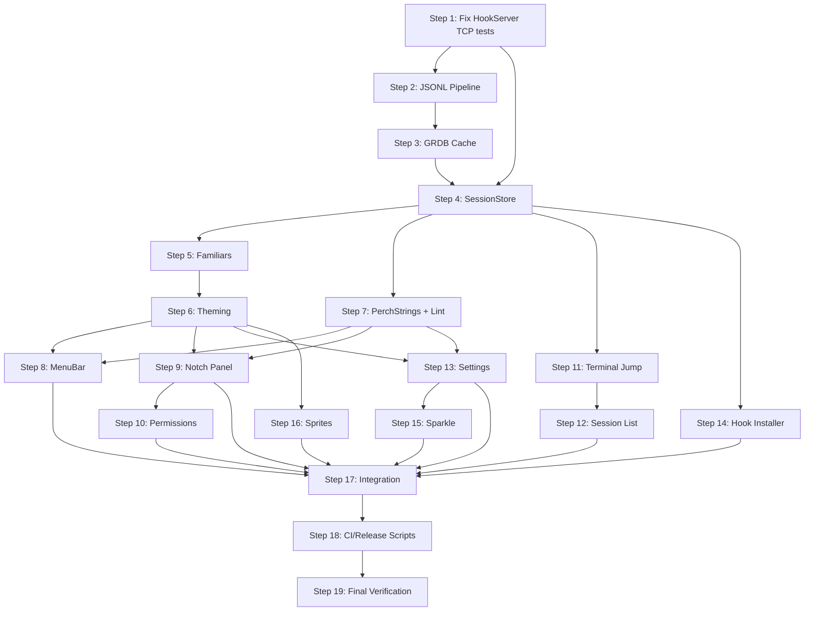

# Perch v1.0.0 — Execution Plan

## Current State Assessment

| Metric | Status |
|--------|--------|
| `swift build` | ✅ Green (3.5s) |
| `swift test` | ⚠️ 16/19 pass, **3 live TCP tests fail** |
| Total source files | 75 Swift files |
| Total test files | 10 Swift files |
| Feature stubs | 23 files, 6–51 LOC each (placeholders) |
| Core stubs | Data, Installer, Theming modules are stubs |
| Phase 0 | ✅ Complete |
| Phase 1a | 🔶 Written but live TCP tests broken |

### Root Cause of 3 Failing Tests

`NWListener` with `port: 0` does **not** assign an ephemeral port in the same way BSD sockets do. The `start()` method stores `candidate` (which is `0`) as `boundPort`, so all live tests connect to `127.0.0.1:0` — which is not a real endpoint. Fix: after the listener transitions to `.ready`, read `listener.port?.rawValue` to get the actual bound port.

---

## Execution Approach — 19 Steps

Every step ends with `swift build` + `swift test` green + a git commit.

---

### Step 1 · Fix Phase 1a — HookServer live TCP tests
**Goal**: Make all 19 tests pass by fixing port-0 handling.

**Changes**:
- [HookServer.swift](file:///Users/divyambhutani/Projects/perch/Perch/Core/HookServer/HookServer.swift) — After `listener.start()`, use a `withCheckedContinuation` to wait for `.ready` state, then read `listener.port?.rawValue` as the actual bound port. If a specific port was requested (non-0), skip the ready-wait and trust the input.
- [HookServerTests.swift](file:///Users/divyambhutani/Projects/perch/Tests/CoreTests/HookServerTests.swift) — No changes needed if the fix works. May add a small delay tolerance.

**Acceptance**: `swift test --filter HookServerTests` → 8/8 green.

---

### Step 2 · Phase 1b — JSONL Pipeline (Parser + Tailer)
**Goal**: Real file-tailing, incremental parsing, file-rotation handling.

**Changes**:
- [TranscriptEvent.swift](file:///Users/divyambhutani/Projects/perch/Perch/Core/Data/Models/TranscriptEvent.swift) — Expand with fields from real Claude Code JSONL: `type`, `subtype`, `message`, `model`, `costUSD`, `durationMs`, `tokenCount`, `sessionID` (with `CodingKeys` for snake_case). Make unknown fields optional.
- [SessionMetrics.swift](file:///Users/divyambhutani/Projects/perch/Perch/Core/Data/Models/SessionMetrics.swift) — Add `sessionID`, `totalTokens`, `lastActivity`, `contextPercentage`, `startedAt`, `cwd`, `project`.
- [JSONLParser.swift](file:///Users/divyambhutani/Projects/perch/Perch/Core/Data/JSONL/JSONLParser.swift) — Rewrite to accept `Data` (not `String`), handle partial trailing lines by returning `(events: [TranscriptEvent], remainder: Data)`. Use lenient decoding that skips unrecognized fields.
- [JSONLTailer.swift](file:///Users/divyambhutani/Projects/perch/Perch/Core/Data/JSONL/JSONLTailer.swift) — Complete rewrite as an `actor`. Use `DispatchSource.makeFileSystemObjectSource` for file-watch. Track file offset; read only new bytes. Handle file rename/rotation by monitoring inode change. Seek-to-end on first attach for large files (§11 gotcha). Stream parsed events via `AsyncStream<TranscriptEvent>`.
- [JSONLIndexer.swift](file:///Users/divyambhutani/Projects/perch/Perch/Core/Data/JSONL/JSONLIndexer.swift) — Rewrite as `actor`. Fold `TranscriptEvent` stream into `[String: SessionMetrics]` keyed by sessionID. Expose `metrics(for sessionID:)` and `allMetrics()`.
- [JSONLError.swift](file:///Users/divyambhutani/Projects/perch/Perch/Core/Data/JSONL/JSONLError.swift) — Add `.fileNotFound`, `.readFailed(Error)`, `.rotationDetected`.
- [JSONLParserTests.swift](file:///Users/divyambhutani/Projects/perch/Tests/CoreTests/JSONLParserTests.swift) — Expand: partial line preservation, multi-line batch, unknown field tolerance.
- [JSONLIndexerTests.swift](file:///Users/divyambhutani/Projects/perch/Tests/CoreTests/JSONLIndexerTests.swift) — Expand: fold multiple events into metrics, context % calculation.
- **[NEW]** `Tests/CoreTests/JSONLTailerTests.swift` — Write temp JSONL, attach tailer, append lines, assert events arrive. Test rotation.

**Acceptance**: Parser handles partial lines. Tailer streams only new bytes. Indexer folds into correct metrics. All tests green.

---

### Step 3 · Phase 1b — GRDB Cache
**Goal**: Persistent SQLite cache that can be rebuilt from JSONL.

**Changes**:
- [DatabaseManager.swift](file:///Users/divyambhutani/Projects/perch/Perch/Core/Data/Database/DatabaseManager.swift) — Use real path `~/Library/Application Support/Perch/cache.sqlite`. WAL mode. Add `upsertSession(_ metrics: SessionMetrics)`, `deleteAll()`, `sessionCount()`.
- [DatabaseMigrations.swift](file:///Users/divyambhutani/Projects/perch/Perch/Core/Data/Database/DatabaseMigrations.swift) — Expand v1 schema: `id TEXT PK`, `project TEXT`, `cwd TEXT`, `startedAt DATETIME`, `lastActivity DATETIME`, `state TEXT`, `contextPercentage REAL`, `totalTokens INTEGER`.
- [SessionRecord.swift](file:///Users/divyambhutani/Projects/perch/Perch/Core/Data/Database/SessionRecord.swift) — Expand to match new schema. Add static `from(_ metrics: SessionMetrics)` factory.
- **[NEW]** `Tests/CoreTests/DatabaseRebuildTests.swift` — Write JSONL fixture → index → persist → delete sqlite → reindex → assert identical rows.

**Acceptance**: Rebuild-from-JSONL test green. GRDB never holds data absent from JSONL (§6.2).

---

### Step 4 · Phase 1c — SessionStore
**Goal**: Single source of truth merging hooks + JSONL metrics. Multi-session support.

**Changes**:
- [SessionStore.swift](file:///Users/divyambhutani/Projects/perch/Perch/Core/Session/SessionStore.swift) — Multi-session support: `sessions` keyed by sessionID. Merge logic: hook event updates in-memory state; JSONL metrics enrich with tokens/context. Derive `sessionState` as pure function. Add `pendingPermission: PermissionRequest?` convenience. Add `updateFromMetrics(_ metrics: SessionMetrics)`.
- [SessionSnapshot.swift](file:///Users/divyambhutani/Projects/perch/Perch/Core/Session/SessionSnapshot.swift) — Add `terminalPID: pid_t?`, `terminalBundleID: String?`, `cwd: String?`.
- [SessionStoreTests.swift](file:///Users/divyambhutani/Projects/perch/Tests/CoreTests/SessionStoreTests.swift) — Expand: hook-before-jsonl merge, approval transitions, state derivation table-driven, multi-session.

**Acceptance**: Hook arrives before JSONL → no dropped update. Approve clears permission → state returns to `.watching`. Pure state derivation tested with 6+ scenarios.

---

### Step 5 · Phase 2a — Familiars (protocol plumbing)
**Goal**: Mascot-agnostic architecture. V1 registers only Seneca.

**Changes**:
- [Familiar.swift](file:///Users/divyambhutani/Projects/perch/Perch/Core/Familiars/Familiar.swift) — Add `spriteDescriptor: SpriteDescriptor` property. `SpriteDescriptor` is a new struct with `mascotID`, `assetDirectory`, `frameSize`.
- [SenecaFamiliar.swift](file:///Users/divyambhutani/Projects/perch/Perch/Core/Familiars/Seneca/SenecaFamiliar.swift) — Implement `spriteDescriptor`.
- [SpriteFrameProvider.swift](file:///Users/divyambhutani/Projects/perch/Perch/Core/Familiars/SpriteFrameProvider.swift) — Accept `(MascotID, FamiliarState, frame: Int)` → load the correct PNG and extract the frame strip slice. Return `(body: CGImage, accentMask: CGImage)` (placeholder until real art lands — generate flat-color PNGs).
- **[NEW]** `Perch/Core/Familiars/SpriteDescriptor.swift` — `struct SpriteDescriptor: Sendable`.
- **[NEW]** `Tests/CoreTests/FamiliarBlindnessTests.swift` — grep `Perch/Features/**/*.swift` for `.seneca`; fail on any hit.

**Acceptance**: `FamiliarRegistry.defaultRegistry().familiar(for: .seneca)` works. Blindness test green.

---

### Step 6 · Phase 2b — Theming (accent LUT renderer)
**Goal**: Accent-only runtime color swap.

**Changes**:
- [PerchTheme.swift](file:///Users/divyambhutani/Projects/perch/Perch/Core/Theming/PerchTheme.swift) — Add `Identifiable`, `Hashable` conformance (id is the string key). Add `displayName: String`.
- [ThemeAccentPalette.swift](file:///Users/divyambhutani/Projects/perch/Perch/Core/Theming/ThemeAccentPalette.swift) — Add `primaryNSColor: NSColor`, `secondaryNSColor: NSColor` computed properties. Add WCAG contrast ratio metadata.
- [ThemePresets.swift](file:///Users/divyambhutani/Projects/perch/Perch/Core/Theming/ThemePresets.swift) — Add `displayName` to each preset. Resolves Agents.md §13 open question.
- [SpriteAccentRenderer.swift](file:///Users/divyambhutani/Projects/perch/Perch/Core/Theming/SpriteAccentRenderer.swift) — Rewrite as `actor`. Accept `(body: CGImage, accentMask: CGImage, palette: ThemeAccentPalette)` → `NSImage`. Cache keyed by `(mascot, state, frame, themeId, appearance)`. Use Core Graphics color replacement.
- [ThemeValidation.swift](file:///Users/divyambhutani/Projects/perch/Perch/Core/Theming/ThemeValidation.swift) — Walk every PNG in `Resources/Mascots/`, assert every non-transparent pixel is in `{body, accent}` palette. (Will pass with placeholder art; will need update when real Seneca PNGs land.)
- [ThemeRendererTests.swift](file:///Users/divyambhutani/Projects/perch/Tests/CoreTests/ThemeRendererTests.swift) — Expand: each preset renders valid NSImage for each state. Cache hit rate > 0.

**Acceptance**: All 6 presets render. Cache works. Palette validation green on placeholder art.

---

### Step 7 · Phase 2c — PerchStrings (copy routing + lint)
**Goal**: All feature copy through `PerchStrings`. Lint test enforces it.

**Changes**:
- [CopyTone.swift](file:///Users/divyambhutani/Projects/perch/Perch/Core/Familiars/CopyTone.swift) — Expand with all v1 string keys: `sessionExpiring`, `contextWindowStatus`, `terminalNotLocated`, `approve`, `deny`, `showPerch`, `quit`, `privacy`, etc.
- [SenecaTone.swift](file:///Users/divyambhutani/Projects/perch/Perch/Core/Familiars/Seneca/SenecaTone.swift) — Fill all new keys with Seneca's terse register.
- [PerchStrings.swift](file:///Users/divyambhutani/Projects/perch/Perch/Core/Strings/PerchStrings.swift) — Add keyed APIs: `sessionExpiring(in:tone:)`, `contextWindow(percentage:tone:)`, `terminalNotLocated(tone:)`, `approve(tone:)`, `deny(tone:)`, etc.
- **[NEW]** `Tests/CoreTests/PerchStringsLintTests.swift` — regex-scan `Perch/Features/**/*.swift` for bare `Text("..."` and `Label("..."` outside `#if DEBUG`; fail on hit.

**Acceptance**: Every user-visible string declared in PerchStrings. Lint test green.

---

### Step 8 · Phase 3a — MenuBar
**Goal**: Working `MenuBarExtra` with themed sprite icon.

**Changes**:
- [MenuBarScene.swift](file:///Users/divyambhutani/Projects/perch/Perch/Features/MenuBar/MenuBarScene.swift) — Return `MenuBarExtra` with label from `PerchStrings`, icon from `MenuBarIconView`.
- [MenuBarIconView.swift](file:///Users/divyambhutani/Projects/perch/Perch/Features/MenuBar/MenuBarIconView.swift) — Read `sessionStore.activeSession.familiarState` + current familiar + theme. Render 16pt sprite via `SpriteAccentRenderer`.
- [MenuBarMenuView.swift](file:///Users/divyambhutani/Projects/perch/Perch/Features/MenuBar/MenuBarMenuView.swift) — Items: Show Perch, Pause, Preferences, Quit. All via `PerchStrings`.

**Acceptance**: Launch → icon visible. State changes reflected within 180ms.

---

### Step 9 · Phase 3b — Notch Panel (NSPanel + sprite animation)
**Goal**: Notch-region overlay with animated Seneca sprite.

**Changes**:
- [NotchPanelController.swift](file:///Users/divyambhutani/Projects/perch/Perch/Features/Notch/NotchPanelController.swift) — Full implementation: `.nonactivatingPanel`, `.hudWindow`, level `.screenSaver`, `collectionBehavior: [.canJoinAllSpaces, .transient]`. Position under notch (center-top of screen). Fallback for non-notched Macs.
- [FamiliarSpriteView.swift](file:///Users/divyambhutani/Projects/perch/Perch/Features/Notch/FamiliarSpriteView.swift) — **CoreAnimation-based** 2-frame animation at 500ms cadence, 180ms ease-out transitions. No `TimelineView` (jank risk per brief §3b).
- [NotchPanelHost.swift](file:///Users/divyambhutani/Projects/perch/Perch/Features/Notch/NotchPanelHost.swift) — `NSHostingView` wrapping `NotchRootView`.
- [NotchRootView.swift](file:///Users/divyambhutani/Projects/perch/Perch/Features/Notch/NotchRootView.swift) — Compose sprite + permission overlay (when `pendingPermission != nil`).

**Acceptance**: Panel appears under notch within 500ms. Stays above full-screen apps. No dropped frames.

---

### Step 10 · Phase 3c — Permissions Overlay
**Goal**: Permission prompt with diff preview, approve/deny round-trip.

**Changes**:
- [PermissionPromptView.swift](file:///Users/divyambhutani/Projects/perch/Perch/Features/Permissions/PermissionPromptView.swift) — Full implementation reading `store.pendingPermission`. All copy via `PerchStrings`.
- [PermissionDiffView.swift](file:///Users/divyambhutani/Projects/perch/Perch/Features/Permissions/PermissionDiffView.swift) — Simple unified-diff renderer with red/green line coloring. No syntax highlighting (v1.1).
- [PermissionActions.swift](file:///Users/divyambhutani/Projects/perch/Perch/Features/Permissions/PermissionActions.swift) — Approve/deny handlers that send response through hook channel.
- [PermissionPromptTests.swift](file:///Users/divyambhutani/Projects/perch/Tests/FeaturesTests/PermissionPromptTests.swift) — Inject synthetic `HookEvent.permissionRequired`, assert prompt renders expected copy.

**Acceptance**: Prompt appears within 100ms. Approve/deny round-trip works in test harness.

---

### Step 11 · Phase 3d — Terminal Jump Service (NEW)
**Goal**: Click a session row → raise the correct terminal window.

**New files**:
- **[NEW]** `Perch/Core/Terminal/ProcessLocator.swift` — Protocol + default impl. Walk `proc_listpids` up the parent chain to find a known terminal bundle ID.
- **[NEW]** `Perch/Core/Terminal/TerminalJumpService.swift` — Actor. `jump(to:) async -> JumpOutcome`. Per-emulator dispatch (Terminal.app, iTerm2 via AppleScript; Ghostty, Warp, Alacritty, Kitty, VSCode, Cursor via `NSRunningApplication.activate`). Unknown fallback: open default terminal at session `cwd`, toast via `PerchStrings.terminalNotLocated`.
- **[NEW]** `Perch/Core/Terminal/JumpOutcome.swift` — Enum: `.raised`, `.activated`, `.fallbackOpened`, `.failed(String)`.
- **[NEW]** `Tests/CoreTests/TerminalJumpTests.swift` — Mock `ProcessLocator`, assert correct AppleScript dispatch for Terminal.app.

**Acceptance**: Fake ProcessLocator → correct dispatch. Unknown emulator → fallback toast.

---

### Step 12 · Phase 3e — Session List + Hotkey
**Goal**: ⌃⌘C opens multi-session list; click jumps to terminal.

**Changes**:
- [SessionHotkeyController.swift](file:///Users/divyambhutani/Projects/perch/Perch/Features/SessionList/SessionHotkeyController.swift) — Use `KeyboardShortcuts` SPM package. Default binding ⌃⌘C.
- [SessionListView.swift](file:///Users/divyambhutani/Projects/perch/Perch/Features/SessionList/SessionListView.swift) — List of `SessionRowView` rows. Keyboard nav (↑/↓/Enter).
- [SessionRowView.swift](file:///Users/divyambhutani/Projects/perch/Perch/Features/SessionList/SessionRowView.swift) — Project name, state badge, context %, countdown. Tap/Enter → `TerminalJumpService.jump(to:)`.
- [SessionListTests.swift](file:///Users/divyambhutani/Projects/perch/Tests/FeaturesTests/SessionListTests.swift) — Expand.

**Acceptance**: ⌃⌘C opens from any space. Keyboard nav works. Click triggers jump.

---

### Step 13 · Phase 3f — Settings
**Goal**: Full settings UI with all tabs.

**Changes**:
- [SettingsView.swift](file:///Users/divyambhutani/Projects/perch/Perch/Features/Settings/SettingsView.swift) — Tabs: General, Familiar, Theme, Updates, Privacy.
- [ThemePickerView.swift](file:///Users/divyambhutani/Projects/perch/Perch/Features/Settings/ThemePickerView.swift) — Show `theme.displayName`. Live preview of sprite.
- [HookInstallerView.swift](file:///Users/divyambhutani/Projects/perch/Perch/Features/Settings/HookInstallerView.swift) — Install/uninstall/reinstall buttons. Status badge.
- [LaunchAtLoginController.swift](file:///Users/divyambhutani/Projects/perch/Perch/Features/Settings/LaunchAtLoginController.swift) — `SMAppService.mainApp`. Report `.requiresApproval`.
- [LaunchAtLoginSettingsView.swift](file:///Users/divyambhutani/Projects/perch/Perch/Features/Settings/LaunchAtLoginSettingsView.swift) — Toggle + "Open Login Items" button.
- [UpdaterController.swift](file:///Users/divyambhutani/Projects/perch/Perch/Features/Settings/UpdaterController.swift) — Wrap `SPUStandardUpdaterController`.
- [UpdaterSettingsView.swift](file:///Users/divyambhutani/Projects/perch/Perch/Features/Settings/UpdaterSettingsView.swift) — Check for Updates, auto-check toggle.
- **[NEW]** `Perch/Features/Settings/PrivacySettingsView.swift` — Explain AppleScript TCC prompts.

**Acceptance**: Theme change updates sprite within 180ms. Launch-at-login survives relaunch.

---

### Step 14 · Phase 4a — Hook Installer (full)
**Goal**: Idempotent install, `_perch` tag, dynamic port.

**Changes**:
- [HookInstaller.swift](file:///Users/divyambhutani/Projects/perch/Perch/Core/Installer/HookInstaller.swift) — Tag Perch entries with `"_perch": true`. Use `AppEnvironment.hookServerURL` (dynamic port). Add `uninstall()` that removes only `_perch`-tagged entries.
- [HookInstallationStatus.swift](file:///Users/divyambhutani/Projects/perch/Perch/Core/Installer/HookInstallationStatus.swift) — Add `.outOfDate`, `.settingsMissing`, `.error(String)`.
- [InstallerError.swift](file:///Users/divyambhutani/Projects/perch/Perch/Core/Installer/InstallerError.swift) — Add `.hookInstallFailed(reason: String)`, `.settingsReadFailed`.
- [CLAUDE.md](file:///Users/divyambhutani/Projects/perch/Support/CLAUDE.md) — Expand: document what Perch installed, uninstall instructions, endpoint URL.
- [HookInstallerTests.swift](file:///Users/divyambhutani/Projects/perch/Tests/CoreTests/HookInstallerTests.swift) — Expand: install twice is no-op, uninstall preserves non-Perch hooks, merge into existing settings.

**Acceptance**: Install creates executable script. Patches settings.json. Uninstall leaves user hooks.

---

### Step 15 · Phase 4b — Sparkle 2 Integration
**Goal**: Auto-update feed configuration.

**Changes**:
- [Release.xcconfig](file:///Users/divyambhutani/Projects/perch/Support/Config/Release.xcconfig) — Add `SUFeedURL`, `SUPublicEDKey`.
- [UpdaterController.swift](file:///Users/divyambhutani/Projects/perch/Perch/Features/Settings/UpdaterController.swift) — Read feed URL from `Bundle.main.infoDictionary`.
- Release scripts — After DMG notarized, run `generate_appcast`.

**Acceptance**: Feed URL resolves. Check-for-updates button works.

---

### Step 16 · Phase 5 — Seneca Sprite Pipeline
**Goal**: Generate placeholder Seneca PNGs that pass palette validation.

**Changes**:
- Generate 4 placeholder PNGs (`idle.png`, `watching.png`, `alert.png`, `working.png`) with strict 2-palette discipline (grey body + yellow-gold accent). Each is a 2-frame horizontal strip.
- Place in `Perch/Resources/Mascots/Seneca/`.
- Verify `ThemeValidation` test passes on them.
- Verify `FamiliarSpriteView` cycles through frames.

**Acceptance**: Palette validation green. Sprite animation plays at 500ms cadence.

---

### Step 17 · App Integration + E2E Wiring
**Goal**: Wire all phases together. PerchApp boots → HookServer starts → JSONL tailer attaches → SessionStore populates → UI renders.

**Changes**:
- [AppBootstrap.swift](file:///Users/divyambhutani/Projects/perch/Perch/App/AppBootstrap.swift) — Wire `TerminalJumpService`, `JSONLTailer`, connect data flow.
- [AppEnvironment.swift](file:///Users/divyambhutani/Projects/perch/Perch/App/AppEnvironment.swift) — Add `TerminalJumpService`. Wire JSONL tailer → indexer → database → sessionStore update loop.
- [AppDelegate.swift](file:///Users/divyambhutani/Projects/perch/Perch/App/AppDelegate.swift) — Set up `NotchPanelController` on launch. Register global hotkey.
- [PerchApp.swift](file:///Users/divyambhutani/Projects/perch/Perch/App/PerchApp.swift) — Ensure all scenes compose correctly.

**Acceptance**: Cold launch → notch sprite renders. Hook event → state change → UI update.

---

### Step 18 · CI + Release Scripts
**Goal**: All scripts functional for the release pipeline.

**Changes**:
- [build.sh](file:///Users/divyambhutani/Projects/perch/Support/scripts/build.sh) — `xcodebuild archive` Release config.
- [archive.sh](file:///Users/divyambhutani/Projects/perch/Support/scripts/archive.sh) — `xcodebuild -exportArchive` with Developer ID.
- [sign.sh](file:///Users/divyambhutani/Projects/perch/Support/scripts/sign.sh) — `codesign --deep --options runtime`. Sparkle XPC signing.
- [dmg.sh](file:///Users/divyambhutani/Projects/perch/Support/scripts/dmg.sh) — `hdiutil create` with app + Applications alias.
- [notarize.sh](file:///Users/divyambhutani/Projects/perch/Support/scripts/notarize.sh) — `xcrun notarytool submit --wait` + `stapler staple`.
- [release.sh](file:///Users/divyambhutani/Projects/perch/Support/scripts/release.sh) — Full orchestration + appcast.
- [ci.yml](file:///Users/divyambhutani/Projects/perch/.github/workflows/ci.yml) — Ensure all tests run.
- [release.yml](file:///Users/divyambhutani/Projects/perch/.github/workflows/release.yml) — Triggered on tag push.

**Acceptance**: Scripts run without errors (dry-run where possible without real certs).

---

### Step 19 · Final Verification + Tag
**Goal**: Complete checklist before `v1.0.0` tag.

**Verification**:
- [ ] `swift test` + `xcodebuild test` green 10 consecutive runs
- [ ] Familiar-blindness test green
- [ ] PerchStrings lint test green
- [ ] Palette validation green on placeholder art
- [ ] Cold launch → notch sprite renders
- [ ] Hook install → `claude` session → permission prompt → approve → state returns
- [ ] ⌃⌘C → session list → click row → terminal window raised
- [ ] Theme switch → all presets render on dark + light
- [ ] Quit mid-session → JSONL resync on relaunch
- [ ] DMG accepted by `spctl` (blocked on real certs)

---

## Dependency Graph

## Risk Register

| Risk | Impact | Mitigation |
|------|--------|------------|
| `NWListener` port 0 behavior differs across macOS versions | Tests fail on CI | Use `listener.stateUpdateHandler` to read actual port from `.ready` state |
| Real Seneca PNGs not delivered | Blocks Phase 5 | Generate strict-palette placeholder PNGs programmatically |
| Sparkle XPC signing complexity | DMG rejected by Gatekeeper | Follow Sparkle's documented `sign_xpc` script; test on fresh user account |
| TCC AppleScript prompts confuse users | Support burden | Privacy settings tab explains why; re-request button |
| JSONL files can be multi-GB | Memory/performance | Seek-to-end on first attach; stream-parse only new bytes |
| macOS 14 compatibility on macOS 26 dev machine | Runtime crashes | Wrap any 15+ API in `#available` with 14.0 fallback; test on 14 VM |

> [!IMPORTANT]
> **Steps 1–4 are the critical path.** All UI work (Steps 8–13) is blocked on having a working data pipeline. I recommend executing Steps 1–4 sequentially, then parallelizing Steps 5–7 (they're independent of each other), then flowing into Steps 8–16.

## Open Decisions for You

1. **Placeholder sprites**: Should I generate flat-color placeholder PNGs programmatically (code-generated at test time), or should I use my `generate_image` tool to create stylized Seneca owl sprites for dev use?
2. **Real certificates**: Steps 18–19 require Apple Developer ID certs and notary credentials. Are these configured, or should I stub the release scripts to be cert-ready but skip actual signing?
3. **macOS 14 testing**: Do you have access to a macOS 14 VM or device for compatibility testing, or should I add `#available` guards defensively and rely on CI?
